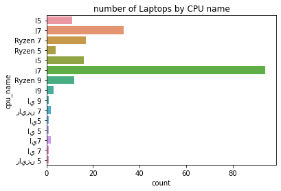
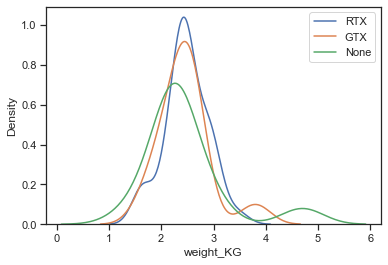

```python
# imports
import pandas as pd
import matplotlib.pyplot as plt
import seaborn as sb
import re
import numpy as np
df_laptop= pd.read_csv('./clean/laptops.csv')
df_laptop.store.value_counts()
```


    Boulanger (FR)    82
    Amazon (SA)       72
    Jumia (EG)        45
    Name: store, dtype: int64


Compate discounts on all sites relative to each other 
1. box plot of discount values for each site 
2. faceit of 3 graphs ... for each site create a scatterplot of discount vs price 
3. a scatterplot of discount vs price with encoding of markers or color on each dataset 

# Univariate Visualisations

what is the price Distribution ?

Price Distribution seems to be concentrated in the 1k to 2k range with decreasing number of laptops as you increase the price


```python
# Histogram of the price distribution
bin_step= 100
bins = np.arange(0, df_laptop['price'].max()+bin_step, bin_step)
_, _, fig= plt.hist(data = df_laptop, x = 'price', bins = bins)
plt.title('Laptops price distribution');
```


what are the expected Disconts on laptops? do most laptops have discounts?

No it seems most laptops have no discount and as the discount value increases the number of laptops decreases. could mean that companies do not want to put discounts on their laptops at least till they are sure they won't sell at this price


```python
# Histogram of discount disctibution 
bin_step= 10
bins = np.arange(0-bin_step//2, df_laptop['discount_value'].max()+bin_step+ bin_step//2, bin_step)
_, _, fig= plt.hist(data = df_laptop, x = 'discount_value', bins = bins)
plt.title('Laptops Discounts distribution');
```


How many laptops are in this dataset from each store?

Boulanger has the most folloerd by Amazon


```python
# compare the number of Laptops that were scrapped from each sotre
df_laptop.head()
sb.countplot(data=df_laptop, y='store');
plt.title('number of Laptops in each store');
```


Does Intel have more laptops than AMD?

Yes it seems Intel is dominanat worldwide


```python
# barplot comapring laptops with Intel vs Laptops with AMD CPU
df_laptop.head()
sb.countplot(data=df_laptop, y='cpu_brand');
plt.title('number of Laptops with Intel vs AMD')
```


    Text(0.5, 1.0, 'number of Laptops with Intel vs AMD')


As you can see in the below graph it seems that some of the CPU names are in arabic while others are in english with some even in Franco

so to get more consistent results we will use cpu_gen and cpu_brand to compare CPU's


```python
# Compare the number of Laptops based on CPU names
df_laptop.head()
sb.countplot(data=df_laptop, y='cpu_name');
plt.title('number of Laptops by CPU name');
```





Are some cpu geneations more prevelant than others? 
yes with the 7 gen beign the most prevalent


```python
# barplot showing the number of laptops for each CPU gen
sb.countplot(data=df_laptop, y='cpu_gen');
plt.title('number of Laptops by CPU generation');
```


is there corelation between Price and discount? 

seems not but it does seem the price and discount values are influenced b where they are sold.


```python
# scatter plot of price vs discount with markers for each store , Amazon was removed as it did not have discounts at that time
df_vis= df_laptop.copy()
df_vis= df_vis[~(df_vis.discount_value ==0)]
markers= [['Jumia (EG)', '^'], ['Boulanger (FR)', 's']]
for category, marker in markers:
    temp= df_vis[df_vis['store']== category]
    sb.regplot(data = temp, x = 'price', y = 'discount_value', marker = marker, fit_reg=False, x_jitter=0.04) 
plt.legend(labels=['Jumia (EG)', 'Boulanger (FR)'])
plt.title('Price vs Discount Comparison')
plt.xlabel('Price in US dollars')
plt.ylabel('Discount in %');
```


Discount values in each store? 

same average discount with Boulanger having more variation.


```python
# Box plot comparing the discount values in each store
base_color = sb.color_palette()[0]
#sb.violinplot(data=df_vis, x='store', y='discount_value', color=base_color, innner=None)
plt.xticks(rotation=15);
sb.boxplot(data=df_vis, x='store', y='discount_value', color=base_color)
plt.title('Discounts in each store')
plt.xlabel('Store')
plt.ylabel('Discount in %');

```


    Text(0, 0.5, 'Discount in %')


compare price for AMD vs Intel CPU 
compare storage options sold on each website
compare shiping time 
compare the brands on each website in a countplot 


```python
# Box plot comparing the price of each CPU brand
df_vis= df_laptop.copy()
# price comparsion between CPU brand 
sb.boxplot(data=df_vis, x='cpu_brand', y='price', color=base_color);
plt.title('Price per CPU brand')
plt.xlabel('CPU Brand')
plt.ylabel('Price')
```


    Text(0, 0.5, 'Price')


does any of the CPU brands have more discounts on average? 

no they seem to be ties with Intel having more outliers that can even reach 50%


```python
# discounts comparsion between CPU brand 
sb.boxplot(data=df_vis, x='cpu_brand', y='discount_value', color=base_color);
plt.title('Discounted value per CPU brand')
plt.xlabel('CPU Brand')
plt.ylabel('Discount in %');
```


Look closer in price per each genearion also

it seems the higher end model are cheaper for AMD then Intel.


```python

# price comparsion between CPU brand 
sb.boxplot(data=df_vis, x='cpu_brand', hue= 'cpu_gen', y='price', color=base_color);
plt.title('Price per CPU brand for each CPU generation')
plt.xlabel('CPU brand')
plt.ylabel('Price in US Dollars');
```


frequency of each CPU geneartion for each site?

the Intel i7 is the most dominant with Intel crushing AMD on each category


```python
# number of cpu sold on all sites while taking into account the CPu generation
sb.countplot(data = df_vis, x = 'cpu_brand', hue = 'cpu_gen', color= base_color)
plt.title('CPU on each site')
plt.xlabel('CPU brand')
plt.ylabel('number of laptops availaible');
```


```python
# brands sold on each site clear intel vicotry
sb.countplot(data = df_vis, x = 'cpu_brand', hue = 'store', color= base_color);
```


regression line using features to predict price 
get most important features for each site 


using the Boulanger data we will try to predict the price using liner Regression (notice the data didnt change this is just the cleaned data from the french site but with all the extra columns)


```python
import statsmodels.api as sm
```


```python
df_fr= pd.read_csv('./clean/boulanger_store.csv')
df_fr.head(1)
```


<div>
<style scoped>
    .dataframe tbody tr th:only-of-type {
        vertical-align: middle;
    }

    .dataframe tbody tr th {
        vertical-align: top;
    }

    .dataframe thead th {
        text-align: right;
    }
</style>
<table border="1" class="dataframe">
  <thead>
    <tr style="text-align: right;">
      <th></th>
      <th>Unnamed: 0</th>
      <th>text</th>
      <th>url</th>
      <th>display</th>
      <th>refresh_rate</th>
      <th>cpu</th>
      <th>storage</th>
      <th>ram</th>
      <th>price</th>
      <th>earliest_arrival</th>
      <th>ports</th>
      <th>price_before_discount</th>
      <th>discount</th>
      <th>cpu_name</th>
      <th>cpu_gen</th>
      <th>cpu_brand</th>
      <th>discount_value</th>
      <th>ram_value</th>
      <th>weight_KG</th>
      <th>store</th>
    </tr>
  </thead>
  <tbody>
    <tr>
      <th>0</th>
      <td>0</td>
      <td>PC Gamer \n\t\t\t\t\t\t\n\t\t\t\t\t\t\tDell\n\...</td>
      <td>https://www.boulanger.com/ref/1152079</td>
      <td>15,6" Full HD (39,6 cm) - 120 Hz</td>
      <td>120 Hz</td>
      <td>Intel Core i5 - 10300H : 2,5 GHz / Turboboost ...</td>
      <td>SSD 512 Go</td>
      <td>Mémoire vive 8 Go - 2,3 kg</td>
      <td>1062</td>
      <td>chez vous dès vendredi 12 mars</td>
      <td>Le + :  USB C + Clavier rétro-éclairé</td>
      <td>1199,00€</td>
      <td>- 24%</td>
      <td>i5</td>
      <td>5</td>
      <td>Intel</td>
      <td>24</td>
      <td>8.0</td>
      <td>2.3</td>
      <td>Boulanger (FR)</td>
    </tr>
  </tbody>
</table>
</div>


```python
df_fr.display.value_counts()
```


    17,3" Full HD (43,9 cm) - 144 Hz           16
    15,6" Full HD (39,6 cm) - 144 Hz           16
    15,6" Full HD (39,6 cm) - 300 Hz            7
    15,6" Full HD (39,6 cm) - 120 Hz            7
    17,3" Full HD (43,9 cm) - 300 Hz            7
    15,6" (39,6 cm) - 144 Hz                    6
    15,6" Full HD (39,6 cm) - 60 Hz             4
    17,3" Full HD (43,9 cm) - 120 Hz            4
    15,6" 4K (39,6 cm) - 60 Hz                  2
    15,6" Full HD (39,6 cm) - 240 Hz            2
    14" Full HD (35,6 cm) - 120 Hz              2
    14" Full HD (35,6 cm) - 60 Hz               2
    17,3" 4K (43,9 cm) - 60 Hz                  1
    17,3" (43,9 cm) - 144 Hz                    1
    16" (40,64 cm) - 144 Hz                     1
    Tactile 15,6" Full HD (39,6 cm) - 60 Hz     1
    15" (38,1 cm) - 144 Hz                      1
    14" Full HD (35,6 cm) - 144 Hz              1
    15,6" (39,6 cm) - 120 Hz                    1
    Name: display, dtype: int64


Feature Engineering 
1. create columns for refresh rate, Dsiplay_type only extract 4k assuming all other displays are Full HD, display_width, dsiplay_height, display_size in inches, 
2. extract features from storage columns SSD, HDD, Size 
    - create col for memory 1 and memory 2 as many laptops have 2 memory slots 
3. extract features ram and weight also clean some columns (done in cleaning)
4. arrival time from 2 weeks, opened for less than 6 days (Used),Indisponible (Not availaible) and remove otheres that take longer as they will add unessacesary varaibles to the model


```python
df_fr.weight_KG.describe()

```


    count    82.000000
    mean      2.467073
    std       0.547284
    min       1.300000
    25%       2.200000
    50%       2.400000
    75%       2.600000
    max       4.700000
    Name: weight_KG, dtype: float64


```python
# create 4 columns: storage_type_1 , storage_capacity_1, storage_type_2, storage_capacity_2
def extract_storage_info(string):
    amount_pattern = r'(?:SSD \d+|Disque dur \d+)'
    amount_expr = re.compile(amount_pattern, re.IGNORECASE)
    occurences= amount_expr.findall(string)
    storage_reg= r'(?:SSD|Disque dur)'
    capacity_reg= r'(\d+)'

    if(len(occurences)==2): # if we have 2 storages
        storage_type1= re.search(storage_reg, occurences[0], re.IGNORECASE)
        strage_type2= re.search(storage_reg, occurences[1], re.IGNORECASE)
        storage_cpacity1= re.search(capacity_reg, occurences[0], re.IGNORECASE)
        storage_cpacity2=  re.search(capacity_reg, occurences[1], re.IGNORECASE)
        return storage_type1[0], storage_cpacity1[0], strage_type2[0], storage_cpacity2[0]
    else:
        storage_type1= re.search(storage_reg, occurences[0], re.IGNORECASE)
        storage_cpacity1= re.search(capacity_reg, occurences[0], re.IGNORECASE)
        return storage_type1[0], storage_cpacity1[0], np.nan, np.nan
df_fr['storage_type_1']= df_fr.storage.map(lambda x:extract_storage_info(x)[0])
df_fr['storage_capacity_1']= df_fr.storage.map(lambda x:extract_storage_info(x)[1])
df_fr['storage_type_2']= df_fr.storage.map(lambda x:extract_storage_info(x)[2])
df_fr['storage_capacity_2']= df_fr.storage.map(lambda x:extract_storage_info(x)[3])
# turn all 1 terra into 1k GB for consistency
df_fr['storage_capacity_1']=df_fr['storage_capacity_1'].map(lambda x: 1000 if float(x)==1 else float(x))
df_fr['storage_capacity_2']=df_fr['storage_capacity_2'].map(lambda x: 1000 if float(x)==1 else float(x))
df_fr.head(1)
```


<div>
<style scoped>
    .dataframe tbody tr th:only-of-type {
        vertical-align: middle;
    }

    .dataframe tbody tr th {
        vertical-align: top;
    }

    .dataframe thead th {
        text-align: right;
    }
</style>
<table border="1" class="dataframe">
  <thead>
    <tr style="text-align: right;">
      <th></th>
      <th>Unnamed: 0</th>
      <th>text</th>
      <th>url</th>
      <th>display</th>
      <th>refresh_rate</th>
      <th>cpu</th>
      <th>storage</th>
      <th>ram</th>
      <th>price</th>
      <th>earliest_arrival</th>
      <th>...</th>
      <th>cpu_gen</th>
      <th>cpu_brand</th>
      <th>discount_value</th>
      <th>ram_value</th>
      <th>weight_KG</th>
      <th>store</th>
      <th>storage_type_1</th>
      <th>storage_capacity_1</th>
      <th>storage_type_2</th>
      <th>storage_capacity_2</th>
    </tr>
  </thead>
  <tbody>
    <tr>
      <th>0</th>
      <td>0</td>
      <td>PC Gamer \n\t\t\t\t\t\t\n\t\t\t\t\t\t\tDell\n\...</td>
      <td>https://www.boulanger.com/ref/1152079</td>
      <td>15,6" Full HD (39,6 cm) - 120 Hz</td>
      <td>120 Hz</td>
      <td>Intel Core i5 - 10300H : 2,5 GHz / Turboboost ...</td>
      <td>SSD 512 Go</td>
      <td>Mémoire vive 8 Go - 2,3 kg</td>
      <td>1062</td>
      <td>chez vous dès vendredi 12 mars</td>
      <td>...</td>
      <td>5</td>
      <td>Intel</td>
      <td>24</td>
      <td>8.0</td>
      <td>2.3</td>
      <td>Boulanger (FR)</td>
      <td>SSD</td>
      <td>512.0</td>
      <td>NaN</td>
      <td>NaN</td>
    </tr>
  </tbody>
</table>
<p>1 rows × 24 columns</p>
</div>


```python
df_fr.ram.value_counts()
```


    Mémoire vive 16 Go - 2,3 kg    7
    Mémoire vive 16 Go - 2,4 kg    7
    Mémoire vive 16 Go - 2,6 kg    6
    Mémoire vive 16 Go - 1,7 kg    5
    Mémoire vive 8 Go - 2,3 kg     4
    Mémoire vive 16 Go - 2,2 kg    4
    Mémoire vive 32 Go - 2,5 kg    4
    Mémoire vive 32 Go - 2,4 kg    4
    Mémoire vive 32 Go - 2,3 kg    3
    Mémoire vive 16 Go - 2,9 kg    3
    Mémoire vive 32 Go - 2,1 kg    3
    Mémoire vive 32 Go - 2,9 kg    3
    Mémoire vive 16 Go - 2,0 kg    2
    Mémoire vive 32 Go - 2,6 kg    2
    Mémoire vive 32 Go - 3,0 kg    2
    Mémoire vive 16 Go - 4,7 kg    2
    Mémoire vive 16 Go - 2,8 kg    1
    2,6 kg                         1
    Mémoire vive 8 Go - 2,6 kg     1
    Mémoire vive 32 Go - 3,2 kg    1
    Mémoire vive 32 Go - 1,6 kg    1
    Mémoire vive 16 Go - 3,5 kg    1
    Mémoire vive 16 Go - 1,3 kg    1
    Mémoire vive 16 Go - 1,6 kg    1
    Mémoire vive 16 Go - 2,1 kg    1
    Mémoire vive 16 Go - 2,7 kg    1
    Mémoire vive 16 Go - 3,0 kg    1
    Mémoire vive 8 Go - 2,2 kg     1
    Mémoire vive 8 Go - 2,4 kg     1
    Mémoire vive 16 Go - 2,5 kg    1
    Mémoire vive 8 Go - 3,0 kg     1
    2,2 kg                         1
    Mémoire vive 8 Go - 2,5 kg     1
    Mémoire vive 8 Go - 2,1 kg     1
    Mémoire vive 16 Go - 1,9 kg    1
    Mémoire vive 8 Go - 3,8 kg     1
    Mémoire vive 64 Go - 2,9 kg    1
    Name: ram, dtype: int64


```python
df_fr.earliest_arrival.value_counts()
df_fr= df_fr[~(df_fr.earliest_arrival=='chez vous dès mardi 23 mars')]
df_fr.earliest_arrival.value_counts()

```


    chez vous dès vendredi 12 mars    61
    sous 6 jours ouvrés               13
    indisponible                       7
    Name: earliest_arrival, dtype: int64


```python
df_model= df_fr.copy()
# one hot encode earliest arrival
df_model= df_fr.join(pd.get_dummies(df_fr.earliest_arrival))
#one hot encode storage_type1
df_model= df_model.join(pd.get_dummies(df_fr.storage_type_1, prefix='type_1'))
df_model= df_model.join(pd.get_dummies(df_fr.storage_type_2, prefix='type_2'))
df_model= df_model.join(pd.get_dummies(df_fr.cpu_brand))
df_model.columns
df_model.dtypes

```


    Unnamed: 0                          int64
    text                               object
    url                                object
    display                            object
    refresh_rate                       object
    cpu                                object
    storage                            object
    ram                                object
    price                               int64
    earliest_arrival                   object
    ports                              object
    price_before_discount              object
    discount                           object
    cpu_name                           object
    cpu_gen                             int64
    cpu_brand                          object
    discount_value                      int64
    ram_value                         float64
    weight_KG                         float64
    store                              object
    storage_type_1                     object
    storage_capacity_1                float64
    storage_type_2                     object
    storage_capacity_2                float64
    chez vous dès vendredi 12 mars      uint8
    indisponible                        uint8
    sous 6 jours ouvrés                 uint8
    type_1_Disque dur                   uint8
    type_1_SSD                          uint8
    type_2_SSD                          uint8
    AMD                                 uint8
    Intel                               uint8
    dtype: object


Create Regression Model to predict the price


```python
# to make sure our matrix is Independent we won't use any of the columns on the right as they will be predicted by the columns on the left
# Intel -> AMD
# sous 6 jours ouvrés, 'chez vous dès vendredi 12 mars' -> 'Indisponible'
# type_1_SSD -> type_1_Disque_dur
df_model['intercept'] = 1

cols_to_consider= ['sous 6 jours ouvrés', 'chez vous dès vendredi 12 mars', 'storage_capacity_1', 'storage_capacity_2', 'ram_value', 'weight_KG',
                   'Intel','type_1_SSD', 'type_2_SSD', 'cpu_gen', 'intercept']
df_model= df_model.fillna(0)
res = sm.OLS(df_model['price'], df_model[cols_to_consider]).fit()
res.summary2()
#df_model[cols_to_consider].dtypes
```


<table class="simpletable">
<tr>
        <td>Model:</td>               <td>OLS</td>         <td>Adj. R-squared:</td>      <td>0.674</td>  
</tr>
<tr>
  <td>Dependent Variable:</td>       <td>price</td>             <td>AIC:</td>          <td>1275.8405</td>
</tr>
<tr>
         <td>Date:</td>        <td>2021-08-04 11:09</td>        <td>BIC:</td>          <td>1302.1794</td>
</tr>
<tr>
   <td>No. Observations:</td>         <td>81</td>          <td>Log-Likelihood:</td>     <td>-626.92</td> 
</tr>
<tr>
       <td>Df Model:</td>             <td>10</td>           <td>F-statistic:</td>        <td>17.52</td>  
</tr>
<tr>
     <td>Df Residuals:</td>           <td>70</td>        <td>Prob (F-statistic):</td>  <td>1.96e-15</td> 
</tr>
<tr>
      <td>R-squared:</td>            <td>0.715</td>            <td>Scale:</td>        <td>3.5775e+05</td>
</tr>
</table>
<table class="simpletable">
<tr>
                 <td></td>                   <th>Coef.</th>   <th>Std.Err.</th>     <th>t</th>     <th>P>|t|</th>   <th>[0.025</th>    <th>0.975]</th>  
</tr>
<tr>
  <th>sous 6 jours ouvrés</th>             <td>-21.9406</td>  <td>349.1187</td>  <td>-0.0628</td> <td>0.9501</td>  <td>-718.2358</td> <td>674.3547</td> 
</tr>
<tr>
  <th>chez vous dès vendredi 12 mars</th>  <td>222.8984</td>  <td>269.1650</td>  <td>0.8281</td>  <td>0.4104</td>  <td>-313.9342</td> <td>759.7311</td> 
</tr>
<tr>
  <th>storage_capacity_1</th>               <td>-0.3465</td>   <td>0.2471</td>   <td>-1.4023</td> <td>0.1653</td>   <td>-0.8394</td>   <td>0.1463</td>  
</tr>
<tr>
  <th>storage_capacity_2</th>               <td>0.6442</td>    <td>1.1015</td>   <td>0.5849</td>  <td>0.5605</td>   <td>-1.5527</td>   <td>2.8411</td>  
</tr>
<tr>
  <th>ram_value</th>                        <td>69.1767</td>   <td>8.7036</td>   <td>7.9480</td>  <td>0.0000</td>   <td>51.8179</td>   <td>86.5356</td> 
</tr>
<tr>
  <th>weight_KG</th>                       <td>137.1850</td>  <td>148.4075</td>  <td>0.9244</td>  <td>0.3585</td>  <td>-158.8044</td> <td>433.1744</td> 
</tr>
<tr>
  <th>Intel</th>                           <td>378.2316</td>  <td>208.1211</td>  <td>1.8174</td>  <td>0.0734</td>  <td>-36.8529</td>  <td>793.3161</td> 
</tr>
<tr>
  <th>type_1_SSD</th>                       <td>67.5440</td>  <td>654.8166</td>  <td>0.1031</td>  <td>0.9181</td> <td>-1238.4465</td> <td>1373.5346</td>
</tr>
<tr>
  <th>type_2_SSD</th>                      <td>-200.2394</td> <td>720.6716</td>  <td>-0.2779</td> <td>0.7819</td> <td>-1637.5737</td> <td>1237.0948</td>
</tr>
<tr>
  <th>cpu_gen</th>                         <td>246.6610</td>   <td>88.6022</td>  <td>2.7839</td>  <td>0.0069</td>   <td>69.9495</td>  <td>423.3726</td> 
</tr>
<tr>
  <th>intercept</th>                      <td>-1312.7757</td> <td>1105.5666</td> <td>-1.1874</td> <td>0.2391</td> <td>-3517.7587</td> <td>892.2073</td> 
</tr>
</table>
<table class="simpletable">
<tr>
     <td>Omnibus:</td>    <td>3.892</td>  <td>Durbin-Watson:</td>   <td>1.194</td>
</tr>
<tr>
  <td>Prob(Omnibus):</td> <td>0.143</td> <td>Jarque-Bera (JB):</td> <td>3.786</td>
</tr>
<tr>
       <td>Skew:</td>     <td>0.523</td>     <td>Prob(JB):</td>     <td>0.151</td>
</tr>
<tr>
     <td>Kurtosis:</td>   <td>2.831</td>  <td>Condition No.:</td>   <td>16680</td>
</tr>
</table>


here we see that the arraival date has a very high p value which means ery litle realtion so we will drop it in out next mode


```python
# to make sure our matrix is Independent we won't use any of the columns on the right as they will be predicted by the columns on the left
# Intel -> AMD
# sous 6 jours ouvrés, 'chez vous dès vendredi 12 mars' -> 'Indisponible'
# type_1_SSD -> type_1_Disque_dur
cols_to_consider= ['storage_capacity_1', 'storage_capacity_2', 'ram_value', 'weight_KG',
                   'Intel','type_1_SSD', 'type_2_SSD', 'cpu_gen', 'intercept']
df_model= df_model.fillna(0)
res = sm.OLS(df_model['price'], df_model[cols_to_consider]).fit()
res.summary2()
```


<table class="simpletable">
<tr>
        <td>Model:</td>               <td>OLS</td>         <td>Adj. R-squared:</td>      <td>0.676</td>  
</tr>
<tr>
  <td>Dependent Variable:</td>       <td>price</td>             <td>AIC:</td>          <td>1273.6821</td>
</tr>
<tr>
         <td>Date:</td>        <td>2021-08-04 11:09</td>        <td>BIC:</td>          <td>1295.2322</td>
</tr>
<tr>
   <td>No. Observations:</td>         <td>81</td>          <td>Log-Likelihood:</td>     <td>-627.84</td> 
</tr>
<tr>
       <td>Df Model:</td>              <td>8</td>           <td>F-statistic:</td>        <td>21.82</td>  
</tr>
<tr>
     <td>Df Residuals:</td>           <td>72</td>        <td>Prob (F-statistic):</td>  <td>1.90e-16</td> 
</tr>
<tr>
      <td>R-squared:</td>            <td>0.708</td>            <td>Scale:</td>        <td>3.5581e+05</td>
</tr>
</table>
<table class="simpletable">
<tr>
           <td></td>             <th>Coef.</th>   <th>Std.Err.</th>     <th>t</th>     <th>P>|t|</th>   <th>[0.025</th>    <th>0.975]</th>  
</tr>
<tr>
  <th>storage_capacity_1</th>   <td>-0.3721</td>   <td>0.2456</td>   <td>-1.5148</td> <td>0.1342</td>   <td>-0.8617</td>   <td>0.1176</td>  
</tr>
<tr>
  <th>storage_capacity_2</th>   <td>0.9484</td>    <td>1.0666</td>   <td>0.8891</td>  <td>0.3769</td>   <td>-1.1780</td>   <td>3.0747</td>  
</tr>
<tr>
  <th>ram_value</th>            <td>71.5960</td>   <td>8.4669</td>   <td>8.4560</td>  <td>0.0000</td>   <td>54.7176</td>   <td>88.4744</td> 
</tr>
<tr>
  <th>weight_KG</th>           <td>119.5744</td>  <td>145.3287</td>  <td>0.8228</td>  <td>0.4133</td>  <td>-170.1331</td> <td>409.2819</td> 
</tr>
<tr>
  <th>Intel</th>               <td>397.2506</td>  <td>200.3558</td>  <td>1.9827</td>  <td>0.0512</td>   <td>-2.1513</td>  <td>796.6525</td> 
</tr>
<tr>
  <th>type_1_SSD</th>          <td>242.3408</td>  <td>619.6859</td>  <td>0.3911</td>  <td>0.6969</td>  <td>-992.9804</td> <td>1477.6620</td>
</tr>
<tr>
  <th>type_2_SSD</th>          <td>-205.5240</td> <td>718.5930</td>  <td>-0.2860</td> <td>0.7757</td> <td>-1638.0130</td> <td>1226.9651</td>
</tr>
<tr>
  <th>cpu_gen</th>             <td>220.7526</td>   <td>85.8248</td>  <td>2.5721</td>  <td>0.0122</td>   <td>49.6640</td>  <td>391.8411</td> 
</tr>
<tr>
  <th>intercept</th>          <td>-1122.1450</td> <td>1019.2988</td> <td>-1.1009</td> <td>0.2746</td> <td>-3154.0799</td> <td>909.7900</td> 
</tr>
</table>
<table class="simpletable">
<tr>
     <td>Omnibus:</td>    <td>3.652</td>  <td>Durbin-Watson:</td>   <td>1.223</td>
</tr>
<tr>
  <td>Prob(Omnibus):</td> <td>0.161</td> <td>Jarque-Bera (JB):</td> <td>3.499</td>
</tr>
<tr>
       <td>Skew:</td>     <td>0.505</td>     <td>Prob(JB):</td>     <td>0.174</td>
</tr>
<tr>
     <td>Kurtosis:</td>   <td>2.866</td>  <td>Condition No.:</td>   <td>15876</td>
</tr>
</table>


findings 
even thought these variables only predict the price by 67% 
it is clear that the ram value is the best predictor of the price followed by the cpu generation and cpu type showing what the price is mostly determiend by when companies are pricing their products 

Looking for relation ships between all the specs of a laptop. 

there are no clear trends but it does seem that Intel has more diversity in it's products. but this could be due to the fact that intel is over represented


```python
sb.set_theme(style="ticks")
cols= ['storage_capacity_1', 'storage_capacity_2', 'ram_value', 'weight_KG','cpu_gen', 'cpu_brand']
sb.pairplot(df_fr[cols], hue='cpu_brand');
```

    C:\Users\Karim\anaconda3\envs\project-env\lib\site-packages\seaborn\distributions.py:305: UserWarning: Dataset has 0 variance; skipping density estimate.
      warnings.warn(msg, UserWarning)
    


Here we will try to estimate the price but this time using also GPU info to get better estimeated 


```python
df_fr.ports.value_counts()
def extract_gpu_info(string):
    """Extracts GPU informatio from strings handeling extra spaces and tabs and diffrent orientaions


    Args:
        string (str): string of the laptop specs

    Returns:
        (string, int): (model generation, model_number)
    """    
    if type(string)!= str:
        return "None", 0
    extract_gpu_type= r'(:?RTX *\d+| GTX *\d+ *(Ti)*)'
    reg_exp= re.search(extract_gpu_type,string, re.IGNORECASE)
    gpu_type= reg_exp[0] if reg_exp else 'None'
    gpu_num= int(re.search(r'\d+', gpu_type, re.IGNORECASE)[0]) if re.search(r'\d+', gpu_type, re.IGNORECASE) else 0
    gpu_brand=  re.search(r'(:?RTX+|GTX)', gpu_type, re.IGNORECASE)[0] if re.search(r'(:?RTX+| GTX)', gpu_type, re.IGNORECASE) else 'None'
    return gpu_brand, gpu_num
df_fr['gpu_gen']= df_fr.ports.map(lambda x:extract_gpu_info(x)[0])
df_fr['gpu_num']= df_fr.ports.map(lambda x:extract_gpu_info(x)[1])
df_fr['gpu_info']= df_fr.ports.map(lambda x:extract_gpu_info(x))
```


```python
df_model= df_fr.copy()
df_model['intercept'] = 1
# one hot encode earliest arrival
df_model= df_fr.join(pd.get_dummies(df_fr.earliest_arrival))
#one hot encode storage_type1
df_model= df_model.join(pd.get_dummies(df_fr.storage_type_1, prefix='type_1'))
df_model= df_model.join(pd.get_dummies(df_fr.storage_type_2, prefix='type_2'))
df_model= df_model.join(pd.get_dummies(df_fr.cpu_brand))
df_model= df_model.join(pd.get_dummies(df_fr.gpu_info, prefix='gpu'))
```


```python
df_model['intercept'] = 1
# "gpu_('None', 0)", removed
cols_to_consider= ['storage_capacity_1', 'storage_capacity_2', 'ram_value', 'weight_KG',
                   'Intel','type_1_SSD', 'type_2_SSD', 'cpu_gen', 'intercept',"gpu_('GTX', 1050)",
       "gpu_('GTX', 1060)", "gpu_('GTX', 1070)", "gpu_('GTX', 1650)",
       "gpu_('GTX', 1660)", "gpu_('RTX', 1650)",
       "gpu_('RTX', 2060)", "gpu_('RTX', 2070)", "gpu_('RTX', 2080)",
       "gpu_('RTX', 3060)", "gpu_('RTX', 3070)", "gpu_('RTX', 3080)"]
df_model= df_model.fillna(0)
res = sm.OLS(df_model['price'], df_model[cols_to_consider]).fit()
res.summary2()
```


<table class="simpletable">
<tr>
        <td>Model:</td>               <td>OLS</td>         <td>Adj. R-squared:</td>      <td>0.764</td>  
</tr>
<tr>
  <td>Dependent Variable:</td>       <td>price</td>             <td>AIC:</td>          <td>1257.2293</td>
</tr>
<tr>
         <td>Date:</td>        <td>2021-08-04 11:09</td>        <td>BIC:</td>          <td>1307.5127</td>
</tr>
<tr>
   <td>No. Observations:</td>         <td>81</td>          <td>Log-Likelihood:</td>     <td>-607.61</td> 
</tr>
<tr>
       <td>Df Model:</td>             <td>20</td>           <td>F-statistic:</td>        <td>13.93</td>  
</tr>
<tr>
     <td>Df Residuals:</td>           <td>60</td>        <td>Prob (F-statistic):</td>  <td>1.11e-15</td> 
</tr>
<tr>
      <td>R-squared:</td>            <td>0.823</td>            <td>Scale:</td>        <td>2.5912e+05</td>
</tr>
</table>
<table class="simpletable">
<tr>
           <td></td>             <th>Coef.</th>   <th>Std.Err.</th>     <th>t</th>     <th>P>|t|</th>   <th>[0.025</th>    <th>0.975]</th>  
</tr>
<tr>
  <th>storage_capacity_1</th>   <td>-0.1921</td>   <td>0.2390</td>   <td>-0.8040</td> <td>0.4246</td>   <td>-0.6701</td>   <td>0.2859</td>  
</tr>
<tr>
  <th>storage_capacity_2</th>   <td>1.0685</td>    <td>1.0563</td>   <td>1.0116</td>  <td>0.3158</td>   <td>-1.0444</td>   <td>3.1813</td>  
</tr>
<tr>
  <th>ram_value</th>            <td>44.5384</td>   <td>9.3537</td>   <td>4.7616</td>  <td>0.0000</td>   <td>25.8283</td>   <td>63.2485</td> 
</tr>
<tr>
  <th>weight_KG</th>            <td>16.5416</td>  <td>135.8016</td>  <td>0.1218</td>  <td>0.9035</td>  <td>-255.1020</td> <td>288.1852</td> 
</tr>
<tr>
  <th>Intel</th>               <td>497.6500</td>  <td>206.2095</td>  <td>2.4133</td>  <td>0.0189</td>   <td>85.1696</td>  <td>910.1304</td> 
</tr>
<tr>
  <th>type_1_SSD</th>          <td>677.4872</td>  <td>765.8972</td>  <td>0.8846</td>  <td>0.3799</td>  <td>-854.5354</td> <td>2209.5098</td>
</tr>
<tr>
  <th>type_2_SSD</th>          <td>217.7379</td>  <td>772.3445</td>  <td>0.2819</td>  <td>0.7790</td> <td>-1327.1812</td> <td>1762.6569</td>
</tr>
<tr>
  <th>cpu_gen</th>             <td>203.0725</td>   <td>79.1111</td>  <td>2.5669</td>  <td>0.0128</td>   <td>44.8268</td>  <td>361.3182</td> 
</tr>
<tr>
  <th>intercept</th>          <td>-1046.3623</td> <td>1058.0404</td> <td>-0.9890</td> <td>0.3267</td> <td>-3162.7581</td> <td>1070.0336</td>
</tr>
<tr>
  <th>gpu_('GTX', 1050)</th>   <td>-491.2036</td> <td>560.8487</td>  <td>-0.8758</td> <td>0.3846</td> <td>-1613.0680</td> <td>630.6607</td> 
</tr>
<tr>
  <th>gpu_('GTX', 1060)</th>   <td>-62.7084</td>  <td>392.0378</td>  <td>-0.1600</td> <td>0.8735</td>  <td>-846.9008</td> <td>721.4840</td> 
</tr>
<tr>
  <th>gpu_('GTX', 1070)</th>   <td>241.6812</td>  <td>585.2809</td>  <td>0.4129</td>  <td>0.6811</td>  <td>-929.0549</td> <td>1412.4174</td>
</tr>
<tr>
  <th>gpu_('GTX', 1650)</th>   <td>-208.3110</td> <td>347.5852</td>  <td>-0.5993</td> <td>0.5512</td>  <td>-903.5849</td> <td>486.9629</td> 
</tr>
<tr>
  <th>gpu_('GTX', 1660)</th>   <td>-219.5559</td> <td>260.0888</td>  <td>-0.8442</td> <td>0.4019</td>  <td>-739.8109</td> <td>300.6992</td> 
</tr>
<tr>
  <th>gpu_('RTX', 1650)</th>   <td>-667.9136</td> <td>523.1894</td>  <td>-1.2766</td> <td>0.2067</td> <td>-1714.4482</td> <td>378.6211</td> 
</tr>
<tr>
  <th>gpu_('RTX', 2060)</th>   <td>-44.2527</td>  <td>236.7257</td>  <td>-0.1869</td> <td>0.8523</td>  <td>-517.7746</td> <td>429.2692</td> 
</tr>
<tr>
  <th>gpu_('RTX', 2070)</th>   <td>-41.0813</td>  <td>198.3976</td>  <td>-0.2071</td> <td>0.8367</td>  <td>-437.9355</td> <td>355.7730</td> 
</tr>
<tr>
  <th>gpu_('RTX', 2080)</th>   <td>588.4288</td>  <td>326.3107</td>  <td>1.8033</td>  <td>0.0764</td>  <td>-64.2898</td>  <td>1241.1474</td>
</tr>
<tr>
  <th>gpu_('RTX', 3060)</th>   <td>249.2119</td>  <td>275.8710</td>  <td>0.9034</td>  <td>0.3699</td>  <td>-302.6124</td> <td>801.0361</td> 
</tr>
<tr>
  <th>gpu_('RTX', 3070)</th>   <td>617.1219</td>  <td>245.3357</td>  <td>2.5154</td>  <td>0.0146</td>  <td>126.3775</td>  <td>1107.8663</td>
</tr>
<tr>
  <th>gpu_('RTX', 3080)</th>   <td>1541.1303</td> <td>306.0059</td>  <td>5.0363</td>  <td>0.0000</td>  <td>929.0274</td>  <td>2153.2333</td>
</tr>
</table>
<table class="simpletable">
<tr>
     <td>Omnibus:</td>    <td>11.840</td>  <td>Durbin-Watson:</td>    <td>1.474</td>
</tr>
<tr>
  <td>Prob(Omnibus):</td>  <td>0.003</td> <td>Jarque-Bera (JB):</td> <td>13.382</td>
</tr>
<tr>
       <td>Skew:</td>      <td>0.746</td>     <td>Prob(JB):</td>      <td>0.001</td>
</tr>
<tr>
     <td>Kurtosis:</td>    <td>4.318</td>  <td>Condition No.:</td>    <td>21406</td>
</tr>
</table>


```python
df_fr['gpu_gen']= df_fr.ports.map(lambda x:extract_gpu_info(x)[0])
df_fr['gpu_num']= df_fr.ports.map(lambda x:extract_gpu_info(x)[1])
df_model= df_fr.copy()
# one hot encode earliest arrival
df_model= df_fr.join(pd.get_dummies(df_fr.earliest_arrival))
#one hot encode storage_type1
df_model= df_model.join(pd.get_dummies(df_fr.storage_type_1, prefix='type_1'))
df_model= df_model.join(pd.get_dummies(df_fr.storage_type_2, prefix='type_2'))
df_model= df_model.join(pd.get_dummies(df_fr.cpu_brand))
df_model= df_model.join(pd.get_dummies(df_fr.gpu_gen, prefix='gpu_type'))
df_model= df_model.join(pd.get_dummies(df_fr.gpu_num, prefix='gpu_num'))
df_model.columns

```


    Index(['Unnamed: 0', 'text', 'url', 'display', 'refresh_rate', 'cpu',
           'storage', 'ram', 'price', 'earliest_arrival', 'ports',
           'price_before_discount', 'discount', 'cpu_name', 'cpu_gen', 'cpu_brand',
           'discount_value', 'ram_value', 'weight_KG', 'store', 'storage_type_1',
           'storage_capacity_1', 'storage_type_2', 'storage_capacity_2', 'gpu_gen',
           'gpu_num', 'gpu_info', 'chez vous dès vendredi 12 mars', 'indisponible',
           'sous 6 jours ouvrés', 'type_1_Disque dur', 'type_1_SSD', 'type_2_SSD',
           'AMD', 'Intel', 'gpu_type_GTX', 'gpu_type_None', 'gpu_type_RTX',
           'gpu_num_0', 'gpu_num_1050', 'gpu_num_1060', 'gpu_num_1070',
           'gpu_num_1650', 'gpu_num_1660', 'gpu_num_2060', 'gpu_num_2070',
           'gpu_num_2080', 'gpu_num_3060', 'gpu_num_3070', 'gpu_num_3080'],
          dtype='object')


Here the model shows to predict price with 0.76% of the price varaible can be interupted using these features
with Ram and CPU brand and CPU geneartion being the most influencial featuers. _NB: this is a single store not the whole datase_


```python
# df_model.dtypes
df_model['intercept'] = 1
# gpu_type_None is removed
cols_to_consider= ['storage_capacity_1', 'storage_capacity_2', 'ram_value', 'weight_KG',
                   'Intel','type_1_SSD', 'type_2_SSD', 'cpu_gen', 'intercept',"gpu_type_GTX", 'gpu_type_RTX', 'gpu_num_1050', 'gpu_num_1060', 'gpu_num_1070', 'gpu_num_1650',
       'gpu_num_1660', 'gpu_num_2060', 'gpu_num_2070', 'gpu_num_2080',
       'gpu_num_3060', 'gpu_num_3070', 'gpu_num_3080']
df_model= df_model.fillna(0)
res = sm.OLS(df_model['price'], df_model[cols_to_consider]).fit()
res.summary2()
```


<table class="simpletable">
<tr>
        <td>Model:</td>               <td>OLS</td>         <td>Adj. R-squared:</td>      <td>0.764</td>  
</tr>
<tr>
  <td>Dependent Variable:</td>       <td>price</td>             <td>AIC:</td>          <td>1257.2293</td>
</tr>
<tr>
         <td>Date:</td>        <td>2021-08-04 11:09</td>        <td>BIC:</td>          <td>1307.5127</td>
</tr>
<tr>
   <td>No. Observations:</td>         <td>81</td>          <td>Log-Likelihood:</td>     <td>-607.61</td> 
</tr>
<tr>
       <td>Df Model:</td>             <td>20</td>           <td>F-statistic:</td>        <td>13.93</td>  
</tr>
<tr>
     <td>Df Residuals:</td>           <td>60</td>        <td>Prob (F-statistic):</td>  <td>1.11e-15</td> 
</tr>
<tr>
      <td>R-squared:</td>            <td>0.823</td>            <td>Scale:</td>        <td>2.5912e+05</td>
</tr>
</table>
<table class="simpletable">
<tr>
           <td></td>             <th>Coef.</th>   <th>Std.Err.</th>     <th>t</th>     <th>P>|t|</th>   <th>[0.025</th>    <th>0.975]</th>  
</tr>
<tr>
  <th>storage_capacity_1</th>   <td>-0.1921</td>   <td>0.2390</td>   <td>-0.8040</td> <td>0.4246</td>   <td>-0.6701</td>   <td>0.2859</td>  
</tr>
<tr>
  <th>storage_capacity_2</th>   <td>1.0685</td>    <td>1.0563</td>   <td>1.0116</td>  <td>0.3158</td>   <td>-1.0444</td>   <td>3.1813</td>  
</tr>
<tr>
  <th>ram_value</th>            <td>44.5384</td>   <td>9.3537</td>   <td>4.7616</td>  <td>0.0000</td>   <td>25.8283</td>   <td>63.2485</td> 
</tr>
<tr>
  <th>weight_KG</th>            <td>16.5416</td>  <td>135.8016</td>  <td>0.1218</td>  <td>0.9035</td>  <td>-255.1020</td> <td>288.1852</td> 
</tr>
<tr>
  <th>Intel</th>               <td>497.6500</td>  <td>206.2095</td>  <td>2.4133</td>  <td>0.0189</td>   <td>85.1696</td>  <td>910.1304</td> 
</tr>
<tr>
  <th>type_1_SSD</th>          <td>677.4872</td>  <td>765.8972</td>  <td>0.8846</td>  <td>0.3799</td>  <td>-854.5354</td> <td>2209.5098</td>
</tr>
<tr>
  <th>type_2_SSD</th>          <td>217.7379</td>  <td>772.3445</td>  <td>0.2819</td>  <td>0.7790</td> <td>-1327.1812</td> <td>1762.6569</td>
</tr>
<tr>
  <th>cpu_gen</th>             <td>203.0725</td>   <td>79.1111</td>  <td>2.5669</td>  <td>0.0128</td>   <td>44.8268</td>  <td>361.3182</td> 
</tr>
<tr>
  <th>intercept</th>          <td>-1046.3623</td> <td>1058.0404</td> <td>-0.9890</td> <td>0.3267</td> <td>-3162.7581</td> <td>1070.0336</td>
</tr>
<tr>
  <th>gpu_type_GTX</th>        <td>414.4369</td>  <td>374.7305</td>  <td>1.1060</td>  <td>0.2732</td>  <td>-335.1357</td> <td>1164.0095</td>
</tr>
<tr>
  <th>gpu_type_RTX</th>        <td>-45.1657</td>  <td>294.1688</td>  <td>-0.1535</td> <td>0.8785</td>  <td>-633.5909</td> <td>543.2595</td> 
</tr>
<tr>
  <th>gpu_num_1050</th>        <td>-905.6405</td> <td>601.2698</td>  <td>-1.5062</td> <td>0.1373</td> <td>-2108.3592</td> <td>297.0781</td> 
</tr>
<tr>
  <th>gpu_num_1060</th>        <td>-477.1453</td> <td>477.3455</td>  <td>-0.9996</td> <td>0.3215</td> <td>-1431.9785</td> <td>477.6879</td> 
</tr>
<tr>
  <th>gpu_num_1070</th>        <td>-172.7556</td> <td>630.4705</td>  <td>-0.2740</td> <td>0.7850</td> <td>-1433.8844</td> <td>1088.3731</td>
</tr>
<tr>
  <th>gpu_num_1650</th>        <td>-622.7479</td> <td>313.5498</td>  <td>-1.9861</td> <td>0.0516</td> <td>-1249.9409</td>  <td>4.4452</td>  
</tr>
<tr>
  <th>gpu_num_1660</th>        <td>-633.9927</td> <td>416.2118</td>  <td>-1.5232</td> <td>0.1330</td> <td>-1466.5404</td> <td>198.5549</td> 
</tr>
<tr>
  <th>gpu_num_2060</th>         <td>0.9130</td>   <td>341.8952</td>  <td>0.0027</td>  <td>0.9979</td>  <td>-682.9793</td> <td>684.8053</td> 
</tr>
<tr>
  <th>gpu_num_2070</th>         <td>4.0844</td>   <td>317.3193</td>  <td>0.0129</td>  <td>0.9898</td>  <td>-630.6486</td> <td>638.8175</td> 
</tr>
<tr>
  <th>gpu_num_2080</th>        <td>633.5945</td>  <td>396.2352</td>  <td>1.5990</td>  <td>0.1151</td>  <td>-158.9940</td> <td>1426.1830</td>
</tr>
<tr>
  <th>gpu_num_3060</th>        <td>294.3776</td>  <td>362.4936</td>  <td>0.8121</td>  <td>0.4200</td>  <td>-430.7176</td> <td>1019.4727</td>
</tr>
<tr>
  <th>gpu_num_3070</th>        <td>662.2876</td>  <td>350.8452</td>  <td>1.8877</td>  <td>0.0639</td>  <td>-39.5073</td>  <td>1364.0825</td>
</tr>
<tr>
  <th>gpu_num_3080</th>        <td>1586.2960</td> <td>387.9886</td>  <td>4.0885</td>  <td>0.0001</td>  <td>810.2033</td>  <td>2362.3888</td>
</tr>
</table>
<table class="simpletable">
<tr>
     <td>Omnibus:</td>    <td>11.840</td>  <td>Durbin-Watson:</td>           <td>1.474</td>       
</tr>
<tr>
  <td>Prob(Omnibus):</td>  <td>0.003</td> <td>Jarque-Bera (JB):</td>        <td>13.382</td>       
</tr>
<tr>
       <td>Skew:</td>      <td>0.746</td>     <td>Prob(JB):</td>             <td>0.001</td>       
</tr>
<tr>
     <td>Kurtosis:</td>    <td>4.318</td>  <td>Condition No.:</td>   <td>15951145266526756864</td>
</tr>
</table>


```python

```

what is the frequencey of each brand with a specific GPU generation

Intel dominates in all but shows that it is more appeling ot non gamers unlike AMD who is uslaly paired with a gaming GPU


```python
cat1_order = ['Intel', 'AMD']
cat2_order = ['RTX', 'GTX', 'None']

plt.figure(figsize = [12, 5])

# left plot: clustered bar chart, absolute counts
plt.subplot(1, 2, 1)
sb.countplot(data = df_fr, x = 'cpu_brand', hue = 'gpu_gen',
             order = cat1_order, hue_order = cat2_order)
plt.legend()


# right plot: stacked bar chart, absolute counts
plt.subplot(1, 2, 2)
df= df_fr
baselines = np.zeros(len(cat1_order))
# for each second-variable category:
for i in range(len(cat2_order)):
    # isolate the counts of the first category,
    cat2 = cat2_order[i]
    inner_counts = df[df['gpu_gen'] == cat2]['cpu_brand'].value_counts()
    # then plot those counts on top of the accumulated baseline
    plt.bar(x = np.arange(len(cat1_order)), height = inner_counts[cat1_order],
            bottom = baselines)
    baselines += inner_counts[cat1_order]

plt.xticks(np.arange(len(cat1_order)), cat1_order)
plt.legend(cat2_order)

```


    <matplotlib.legend.Legend at 0x2105f81f388>


How does the distribution of price vary based on which GPU is used?

cOntrary to popular belif it seems that laptops with no GPU are very diverse and can be even more expensive then laptops with GTX.


```python

plt.figure(figsize = [12, 5])
base_color = sb.color_palette()[3]

# left plot: violin plot
plt.subplot(1, 3, 1)
ax1 = sb.violinplot(data = df, x = 'gpu_gen', y = 'price', color = base_color)

# center plot: box plot
plt.subplot(1, 3, 2)
sb.boxplot(data = df, x = 'gpu_gen', y = 'price', color = base_color)
plt.ylim(ax1.get_ylim()) # set y-axis limits to be same as left plot

# right plot: swarm plot
plt.subplot(1, 3, 3)
sb.swarmplot(data = df, x = 'gpu_gen', y = 'price', hue='cpu_brand',color = base_color)
plt.ylim(ax1.get_ylim()) # set y-axis limits to be same as left plot
```


    (-236.8416644812388, 7253.425359872487)


expore when is each cpu gen paired with a gpu gen 


```python

```


```python

plt.figure(figsize = [12, 5])
base_color = sb.color_palette()[3]

# left plot: violin plot
plt.subplot(1, 3, 1)
ax1 = sb.violinplot(data = df, x = 'gpu_gen', y = 'weight_KG', color = base_color)

# center plot: box plot
plt.subplot(1, 3, 2)
sb.boxplot(data = df, x = 'gpu_gen', y = 'weight_KG', color = base_color)
plt.ylim(ax1.get_ylim()) # set y-axis limits to be same as left plot

# right plot: swarm plot
plt.subplot(1, 3, 3)
sb.swarmplot(data = df, x = 'gpu_gen', y = 'weight_KG', hue='cpu_brand',color = base_color)
plt.ylim(ax1.get_ylim()) # set y-axis limits to be same as left plot
```


    (0.24286315590093643, 5.7571368440990645)


Is there a relation between the price and the weight of a device?

 _NB: this data is only availaible in the French store as it was not mentioed in the other stores

 it seems there is no consistent realtion but laptops with GPU usually weight from 2 to 3 kilos 


```python
cat= ['RTX', 'GTX', 'None']
for i, category in enumerate(cat):
    sb.regplot(data= df_fr[df_fr.gpu_gen==category], x='weight_KG', y='price', fit_reg=False, color=sb.color_palette()[i]);
plt.legend(cat)
```


    <matplotlib.legend.Legend at 0x2105fb11a88>


What is the weight distribution of Laptops with diffrent GPU's installed relative to each other? to see weather laptops with GPU are actually heavier? 

they are not heavier but they are not light either it seems they are simply more concentrated between 2 and 3 KG with almost no putliers while Laptops without a gaming GPU seem to also sometimes weight as low as 1 kilo but can sometimes also weight a lot heavier


```python
cat= ['RTX', 'GTX', 'None']
for i, category in enumerate(cat):
    sb.kdeplot(df_fr[df_fr.gpu_gen==category]['weight_KG']);
plt.legend(cat);
```





```python

```

Laptops with GPU do not seem to be heavier then those without 


```python
df_fr.columns
```


    Index(['Unnamed: 0', 'text', 'url', 'display', 'refresh_rate', 'cpu',
           'storage', 'ram', 'price', 'earliest_arrival', 'ports',
           'price_before_discount', 'discount', 'cpu_name', 'cpu_gen', 'cpu_brand',
           'discount_value', 'ram_value', 'weight_KG', 'store', 'storage_type_1',
           'storage_capacity_1', 'storage_type_2', 'storage_capacity_2', 'gpu_gen',
           'gpu_num', 'gpu_info'],
          dtype='object')


Show a coreelation martix of all the features to see any strong corelations?

the most notable is RAM value and price


```python
# correlation plot
numeric_vars= [
       'price','cpu_gen',
       'discount_value', 'ram_value', 'weight_KG','storage_capacity_1',
       'storage_capacity_2','gpu_num']
plt.figure(figsize = [8, 5])
sb.heatmap(df_fr[numeric_vars].corr(), annot = True, fmt = '.3f',
           cmap = 'vlag_r', center = 0)
plt.show()
```


this shows that there are only 3 strong corellations 
1. price and ram as ram seems to be very involved with price
2. ram and gpu_num so high end laptops usally are given high end rams 
3. price and 2nd_storage capacity which does show that laptops get a lop more expensive when a 2nd storage is added

See if there is a correlation between any of the Features? 

Doesn't seem to be anything noticable


```python
g = sb.PairGrid(data = df_fr, vars = numeric_vars)
g = g.map_diag(plt.hist, bins = 20);
g.map_offdiag(sb.stripplot, jitter= True, color='red');
# g.map(sb.stripplot, jitter=True, size=3);
```


```python
df_eg= pd.read_csv('./clean/jumia_store.csv')
df_eg.sample(5)
```


<div>
<style scoped>
    .dataframe tbody tr th:only-of-type {
        vertical-align: middle;
    }

    .dataframe tbody tr th {
        vertical-align: top;
    }

    .dataframe thead th {
        text-align: right;
    }
</style>
<table border="1" class="dataframe">
  <thead>
    <tr style="text-align: right;">
      <th></th>
      <th>Unnamed: 0</th>
      <th>url</th>
      <th>text</th>
      <th>discount</th>
      <th>original_price_EPG</th>
      <th>brand</th>
      <th>brand_url</th>
      <th>price</th>
      <th>discount_value</th>
      <th>ram_value</th>
      <th>cpu_name</th>
      <th>cpu_gen</th>
      <th>cpu_brand</th>
      <th>store</th>
    </tr>
  </thead>
  <tbody>
    <tr>
      <th>44</th>
      <td>47</td>
      <td>https://www.jumia.com.eg/omen-15-gaming-laptop...</td>
      <td>HP OMEN 15 Gaming Laptop - Intel Core I7 - 16G...</td>
      <td>17%</td>
      <td>EGP 29,999</td>
      <td>HP</td>
      <td>https://www.jumia.com.eg/hp/</td>
      <td>1800</td>
      <td>17</td>
      <td>16</td>
      <td>I7</td>
      <td>7</td>
      <td>Intel</td>
      <td>Jumia (EG)</td>
    </tr>
    <tr>
      <th>26</th>
      <td>27</td>
      <td>https://www.jumia.com.eg/hp-pavilion-gaming-15...</td>
      <td>HP Pavilion Gaming - 15-dk0056wm 1TB+256 SSD C...</td>
      <td>9%</td>
      <td>EGP 15,188</td>
      <td>HP</td>
      <td>https://www.jumia.com.eg/hp/</td>
      <td>911</td>
      <td>9</td>
      <td>8</td>
      <td>I5</td>
      <td>5</td>
      <td>Intel</td>
      <td>Jumia (EG)</td>
    </tr>
    <tr>
      <th>11</th>
      <td>11</td>
      <td>https://www.jumia.com.eg/gf65-thin-9sexr-gamin...</td>
      <td>MSI GF65 Thin 9SEXR Gaming Laptop - Intel Core...</td>
      <td>20%</td>
      <td>EGP 19,999</td>
      <td>MSI</td>
      <td>https://www.jumia.com.eg/msi/</td>
      <td>1200</td>
      <td>20</td>
      <td>16</td>
      <td>I7</td>
      <td>7</td>
      <td>Intel</td>
      <td>Jumia (EG)</td>
    </tr>
    <tr>
      <th>22</th>
      <td>23</td>
      <td>https://www.jumia.com.eg/msi-gf63-thin-gaming-...</td>
      <td>MSI GF63 Thin Gaming Laptop - Intel Core I5 - ...</td>
      <td>18%</td>
      <td>EGP 13,999</td>
      <td>MSI</td>
      <td>https://www.jumia.com.eg/msi/</td>
      <td>840</td>
      <td>18</td>
      <td>8</td>
      <td>I5</td>
      <td>5</td>
      <td>Intel</td>
      <td>Jumia (EG)</td>
    </tr>
    <tr>
      <th>20</th>
      <td>21</td>
      <td>https://www.jumia.com.eg/g5-15-5500-gaming-lap...</td>
      <td>DELL G5 15-5500 Gaming Laptop - Intel Core I7-...</td>
      <td>11%</td>
      <td>EGP 20,499</td>
      <td>DELL</td>
      <td>https://www.jumia.com.eg/dell/</td>
      <td>1230</td>
      <td>11</td>
      <td>16</td>
      <td>I7</td>
      <td>7</td>
      <td>Intel</td>
      <td>Jumia (EG)</td>
    </tr>
  </tbody>
</table>
</div>


```python

```


```python
plt.figureSize= 20, 8
plt.subplot(1, 3, 1)
df=df_eg
ax1 = sb.violinplot(data = df, x = 'cpu_gen', y = 'price', color = base_color)

# center plot: box plot
plt.subplot(1, 3, 2)
sb.boxplot(data = df, x = 'cpu_gen', y = 'price', color = base_color)
plt.ylim(ax1.get_ylim()) # set y-axis limits to be same as left plot

# right plot: swarm plot
plt.subplot(1, 3, 3)
sb.swarmplot(data = df, x = 'cpu_gen', y = 'price', color = base_color)
plt.ylim(ax1.get_ylim()); # set y-axis limits to be same as left plot
```


```python
df_laptop.store.value_counts()
```


    Boulanger (FR)    82
    Amazon (SA)       72
    Jumia (EG)        45
    Name: store, dtype: int64


```python
df_vis= df_laptop.copy()
# df_vis= df_vis[~(df_vis.discount_value ==0)]
markers= [['Jumia (EG)', '^'], ['Boulanger (FR)', 's'], ['Amazon (SA)', 'o']]
for i ,(category, marker) in enumerate(markers):
    temp= df_vis[df_vis['store']== category]
    sb.swarmplot(data = temp, y= 'price', x= 'cpu_gen', color= sb.color_palette()[i]) 
plt.legend(labels=['Jumia (EG)', 'Boulanger (FR)', 'Amazon (SA)'])
```


    <matplotlib.legend.Legend at 0x2105db4e648>


```python
# i think this is enough now just get all the data and get piechart for intel vs amd and any vis that works on entire dataset use it also extract the gpu values from egy store to use them in the vis of fr store
```


```python
# re-using code to plot depth and table.
fig, ax = plt.subplots(nrows=2, figsize = [9,8])

variables = [['price',200], ['discount_value', 3]]
# bin_size= 10
for i, (var, bin_size) in enumerate(variables):
    bins = np.arange(min(df[var])-bin_size//2, max(df[var])+bin_size+bin_size//2, bin_size)
    ax[i].hist(data = df, x = var, bins = bins)
    ax[i].set_xlabel('{}'.format(var))
plt.xlim((3, 50))
plt.show()
```


```python
df_sa= pd.read_csv('./clean/amazon_sa_store.csv')
df_full= pd.concat([df_fr,df_eg, df_sa]).drop_duplicates().reset_index(drop=True)
df_full.shape
```


    (200, 30)


Here we explore the frequency of a manufacturer pairing a GPU with each CPU brand

AMD seems to be more gaming oriented as it almost is never sold without a gaming GPU

Intel on the other hand has a healthy mix as it is sometimes also sold with no gaming GPU like in slimbooks.


```python
cat1_order = ['Intel', 'AMD']
cat2_order = ['RTX', 'GTX', 'None']

plt.figure(figsize = [12, 5])

# left plot: clustered bar chart, absolute counts
plt.subplot(1, 2, 1)
sb.countplot(data = df_fr, x = 'cpu_brand', hue = 'gpu_gen',
             order = cat1_order, hue_order = cat2_order)
plt.legend()


# right plot: stacked bar chart, absolute counts
plt.subplot(1, 2, 2)
df= df_full
baselines = np.zeros(len(cat1_order))
# for each second-variable category:
for i in range(len(cat2_order)):
    # isolate the counts of the first category,
    cat2 = cat2_order[i]
    inner_counts = df[df['gpu_gen'] == cat2]['cpu_brand'].value_counts()
    # then plot those counts on top of the accumulated baseline
    plt.bar(x = np.arange(len(cat1_order)), height = inner_counts[cat1_order],
            bottom = baselines)
    baselines += inner_counts[cat1_order]

plt.xticks(np.arange(len(cat1_order)), cat1_order)
plt.legend(cat2_order)

```


    <matplotlib.legend.Legend at 0x21065bd1108>


The GTX is not paired a lot with Generation 9 CPU and it is mostly paired with Gen 7 CPU. yet it is the most comman in out dataset


```python
df_full= pd.concat([df_fr,df_eg, df_sa]).drop_duplicates().reset_index(drop=True)
df_vis= df_full[~df_full.gpu_gen.isna()]
df_vis= df_full[~df_full.cpu_gen.isna()]
df_vis['cpu_gen']= df_full.cpu_gen.map(lambda x: int(x))
df_vis= df_vis[df_vis.cpu_gen > 3]
df_vis.gpu_gen.value_counts()
# sb.barplot(data=df_vis, x='VClass', y='comb', color=base_color, errwidth=0)
df_vis.groupby(['cpu_gen', 'gpu_gen']).count()
# vis
g = sb.FacetGrid(data = df_vis, col = 'cpu_gen', col_wrap = 7)

g.map(sb.countplot, "gpu_gen")

```

    C:\Users\Karim\anaconda3\envs\project-env\lib\site-packages\seaborn\axisgrid.py:645: UserWarning: Using the countplot function without specifying `order` is likely to produce an incorrect plot.
      warnings.warn(warning)
    


    <seaborn.axisgrid.FacetGrid at 0x21065bf0dc8>


Looking for a relation between price, discount and cpu_gen


```python
g = sb.PairGrid(data = df, vars = ['price', 'discount_value', 'cpu_gen'])
g.map_diag(plt.hist, bins=15)
g.map_offdiag(plt.scatter)
```


    <seaborn.axisgrid.PairGrid at 0x2106604a808>


Look at the average price for each combination of CPU and GPU generations

it is clear that the RTX with 9th gen is the most impressive
but what I think is worth noting is that 9th Gen Cpu without a GPU actually come in second place. which shows that most of the price diffrence is due to the CPU


```python
df= df_full
cat_means = df.groupby(['cpu_gen', 'gpu_gen']).mean()['price']
cat_means = cat_means.reset_index(name = 'price_avg')
cat_means = cat_means.pivot(index = 'cpu_gen', columns = 'gpu_gen',
                            values = 'price_avg')
sb.heatmap(cat_means, annot = True, fmt = '.3f',
           cbar_kws = {'label' : 'average price in US dollars'});
```


see the number of laptops in each category


```python
df= df_full
cat_means = df.groupby(['cpu_gen', 'gpu_gen']).nunique()['text']
cat_means = cat_means.reset_index(name = 'price_avg')
cat_means = cat_means.pivot(index = 'cpu_gen', columns = 'gpu_gen',
                            values = 'price_avg')
sb.heatmap(cat_means, annot = True,
           cbar_kws = {'label' : 'average price in US dollars'});
```


```python
# exoprts 
!jupyter nbconvert Exploratory.ipynb --to markdown

```


```python

```
