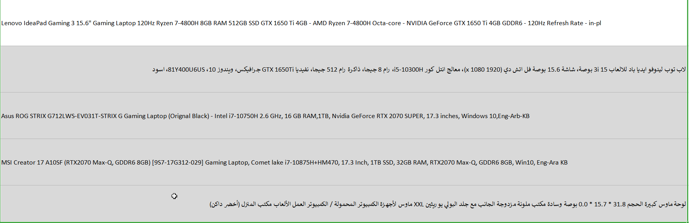
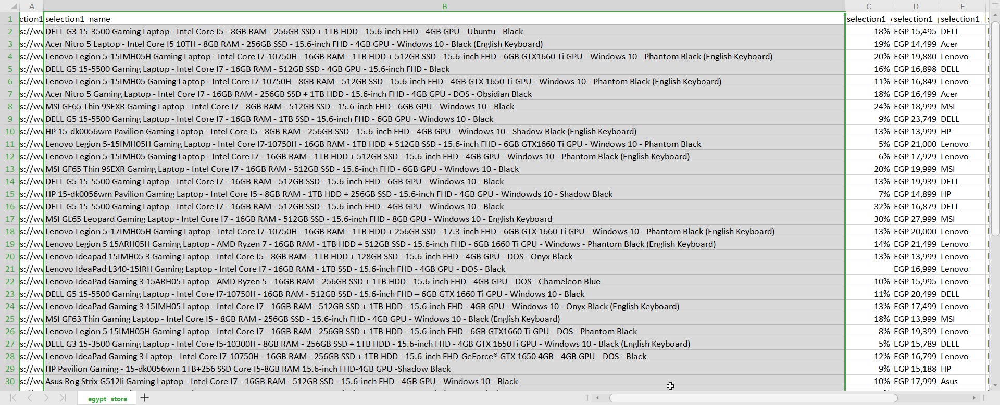
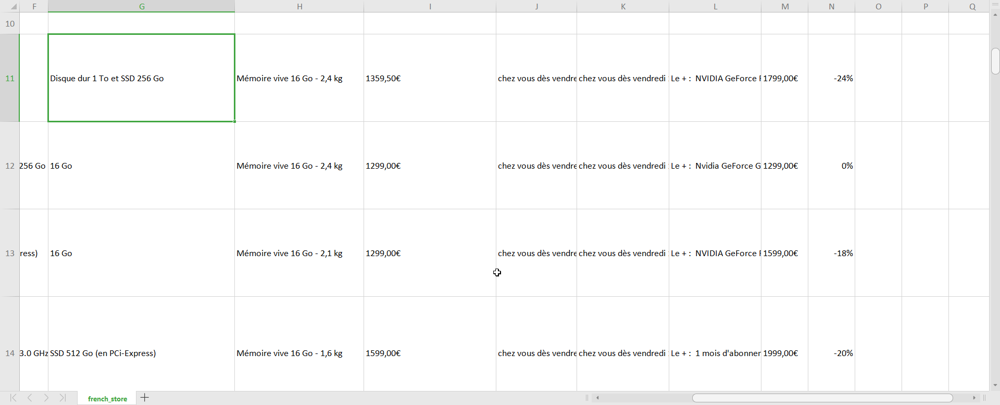

# Cleaning

> Three sites with 3 diffrent Languages won't be easy 👀

Because every Dataset was scrapped from a diffrent site using a diffrent script and beacuse each site has a diffrent layout. the data is naturally messy.

Here you can find my thoughts process with some examples for each dataset.

### These are the main problem I had to fix. details on how I did that are in the [Cleaning notebook](/clean.ipynb)

## sa_store.csv (Amazon.sa)
> This Dataset was terrible as Amazon put all the features into 1 column which is the name of the product

---
> Even more the Sellers did not even have to write in english so some of the words were in english, some arabic and some Franco (Arabic letters with Enlish pronouciation). also some entries had both english and arabic letters in the same column

---

> Not all the results were even laptops some of them were simply Laptop accessories

*Ex: in the above picture the last row is actually a mouse pad*

---
### Tasks
1. extract GPU info including GPU model number and generation
2. extract CPU 
3. exrtact Ram info
4. extract Storage info including Storage type and capacity 
5. dont forget there could also be a 2nd storage we need to account for
6. remove Nan values
7. Remove non Laptop Entries

## egypt_store.csv (Jumia)
> this Dataset had a lot of bad columns with many of the features in the name like the CPU type, Ram, Storage so they had to be extracted. luckly there was a pattern in how the site wrote it's info which I was sometimes able to exploit

---
### Tasks
1. extract GPU info including GPU model number and generation
2. extract CPU 
3. exrtact Ram info
4. extract Storage info including Storage type and capacity 
5. dont forget there could also be a 2nd storage we need to account for
6. remove Nan values
7. make sure everything is consistent

## french.csv (Boulangaire)
> this was the most consistent and cleaned data as almost every feature was extracted in it;s own column
---
> A bit tricky as it was written in French so the extraction of the columns had to be done in french too.

---
### Tasks
1. extract GPU info including GPU model number and generation
2. extract CPU 
3. extract Weight
4. extract Storage info including Storage type and capacity 
5. dont forget there could also be a 2nd storage we need to account for
6. remove Nan values
7. exrtact Ram info

