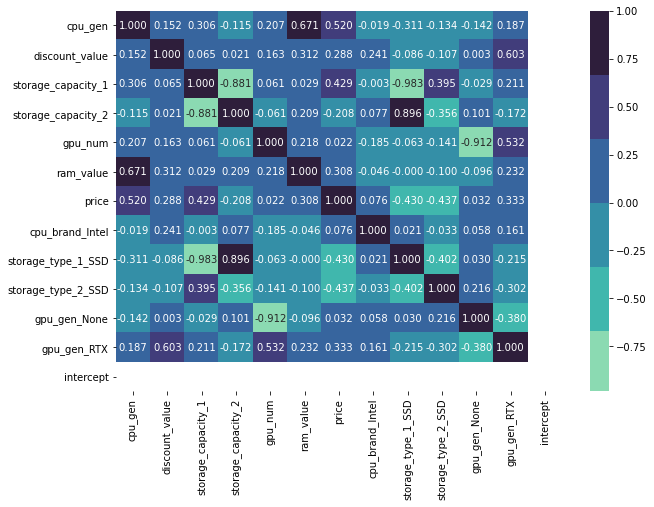
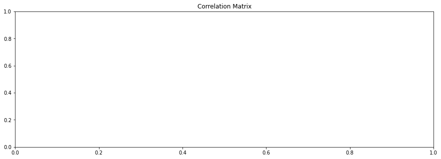
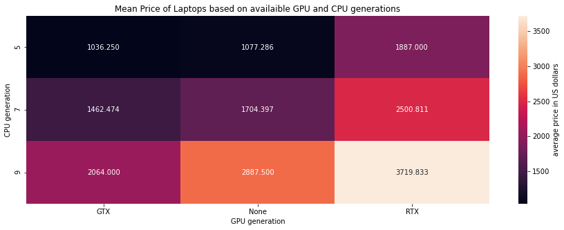

# Laptops Dataset

    <h1>
Introduction
</h1>

**Gaming Laptops** are a very widespread product sold in all parts of the wrold with a huge price varaition and quality variation. we explore today the realtion between price, the reigion, discount, cpu, gpu, ram.

This Dataset was scrapped from Jumia.eg, Amazon.sa, Boulanger.fr

Cleaning link i guess

## Dataset Source (Scrapped)

the Dataset consists of 3 scrapped ecommerce websites that were all scraped on the same day 1/5/2020.

each of the websites is it's own format and structure.

1- website 1: [Jumia](https://www.jumia.com.eg/) which is an egyptian ecommerce site that sells all products but is known for its tech deals and high discounts.

2- [Amazon.sa](https://www.amazon.sa/) which is the subsidary of the famous company Amazon in Saudi Arabia (KSA).

3- [Boulanger](https://www.boulanger.com/) a local french eccomerce site that is famous for cheap prices espacially in the salles.

each of these site had a search term "Gaming Laptop" written in the search bar and then the result was scrapped for either 5 pages or till the end.

_NB:this data was scrapped programmatically from 3 diffrent sites in 3 diffrent contries with a vpn to assure local data is shown._

#

    <h1>
DataSet
</h1>

Dataset Description

    <h3>Feature Description</h3>

## Laptops.csv 

    - this is the aggregated dataset that was created during the cleaning phase from merging the scraped data from all 3 sites

1. __text:__ scraped text from the site 

2. __url:__ the url of the link that was scrapped

3. __price:__ price in dollars after cleaning and unifing the dataset

4. **cpu_name:** the name of the cpu like i7, Ryzen 5

5. **cpu_gen:** the generation of the cpu, ex: generation 7, 9, 5

6. **discount_value:** the percentage of the discount

7. **store** the store from which this row was scrapped

## egypt_store.csv

> Original dataset that was scraped from Jumia.eg
> further cleaning and feature extraction was done on this dataset during the cleaning phase
1. **selection1_url:** url pointing to the link of the product

2. **selection1_name:** name of the product as written on the site

3. **selection1_discount:** discount value

4. **selection1_price:** price of the product in EGP

5. **selection1_brand:** Brand name (ex: Lenovo, DELL)

6. **selection1_brand_url:** link to the main site of the brand like Lenovo

## french store.csv 
> Original dataset that was scraped from Jumia.eg
> further cleaning and feature extraction was done on this dataset during the cleaning phase

1. **Title:** name of the product on the site

2. **Title_link:** link to product

3.**bestpoints:** dsplay info and other usefull info of the product 
**caracValue:** column with info about the specs of the laptop but it is not consistent so it has to be cleaned

1. **caracValue1:** refresh rate of dsiplay 

2. **caracValue2:** cpu inforamtion

3. **caracValue3** storage info
 
4. **fix-price:** price in EUR

5. **stock:** stock infromation also info about delivery 

6. **nb-opcom-1:** more specs like I/O ports and other modules 

7. **Le+:** more specs

8. **priceBarre:** price before discount in EUR

9. **priceDiscount:** discount

## sa_store.csv
> data scrapped from amazon KSA
> all the laptop specs were cramped in the name of the product so a lot of cleaning had to be done to extract these features

1. **selection1_name:** name of the product which has all the specs in it

2. **selection1_url:** link to product

3. **selection1_selection2:** price in SAR

4. **selection1_selection2_url:** link to product

#

    <h1>
Goals/Motives
</h1>

1. predict the prices of the laptops using extra extracted features from the individul datasets and then combining them using Feature Engineering.

2. Find the relation between discount_value and price 

3. Find patterns between what Laptop manufacturers choose pair between GPU's and CPU's and how this relates to the price of the product

#

    <h1>
Cleaning
</h1>

Three sites with 3 diffrent Languages won't be easy 👀

### These are the main problem I had to fix. details on how I did that are in the [Cleaning notebook](/clean.ipynb)

## sa_store.csv (Amazon.sa)
> This Dataset was terrible as Amazon put all the features into 1 column which is the name of the product
---
> Even more the Sellers did not even have to write in english so some of the words were in english, some arabic and some Franco (Arabic letters with Enlish pronouciation). also some entries had both english and arabic letters in the same column
---
> Not all the results were even laptops some of them were simply Laptop accessories

1. extract GPU info including GPU model number and generation
2. extract CPU 
3. exrtact Ram info
4. extract Storage info including Storage type and capacity 
5. dont forget there could also be a 2nd storage we need to account for
6. remove Nan values
7. Remove non Laptop Entries

## egypt_store.csv (Jumia)
> this Dataset had a lot of bad columns with many of the features in the name like the CPU type, Ram, Storage so they had to be extracted. luckly there was a pattern in how the site wrote it's info which I was sometimes able to exploit

1. extract GPU info including GPU model number and generation
2. extract CPU 
3. exrtact Ram info
4. extract Storage info including Storage type and capacity 
5. dont forget there could also be a 2nd storage we need to account for
6. remove Nan values
7. make sure everything is consistent

## french.csv (Boulangaire)
> this was the most consistent and cleaned data as almost every feature was extracted on it's own 
---
> A bit tricky as it was written in French so the extraction of the columns had to be done in french too.

1. extract GPU info including GPU model number and generation
2. extract CPU 
3. extract Weight
4. extract Storage info including Storage type and capacity 
5. dont forget there could also be a 2nd storage we need to account for
6. remove Nan values
7. exrtact Ram info

# Imports and Setup

# Intel vs AMD
show the diffrence between sales from intel and from AMD 
as we can see it seems that there are more intel laptops then there are AMD. 

# Comapre the price of Laptops with Intel Based CPU vs AMD based CPU

Intel and AMD seem to have the same average price with AMD having a varity in price and Intel having more Outliers 

But taking another Look at the Data while splitting every CPU generation alone.

it seems that Intel Laptops with 9th gen CPU are much more expensive then there AMD counterpart 

# Feature Engineering 
## Motives 
predict the prices of the laptops using extra extracted features from the individul datasets

1. extract GPU types from the names of the rows
2. extract the ram number when availaible
3. extract storage types and storage capacity

### Boulager Dataset
Luckly this dataset is pretty clean and we only have to extract a few features from the columns

1. extract GPU info from the ports column
2. extract storage info like which type of storage and the capacity also do it for laptops with 2 storages

<table border="1" class="dataframe">
  <thead>
    <tr style="text-align: right;">
      <th></th>
      <th>Unnamed: 0</th>
      <th>text</th>
      <th>url</th>
      <th>display</th>
      <th>refresh_rate</th>
      <th>cpu</th>
      <th>storage</th>
      <th>ram</th>
      <th>price</th>
      <th>earliest_arrival</th>
      <th>...</th>
      <th>ram_value</th>
      <th>weight_KG</th>
      <th>store</th>
      <th>gpu_gen</th>
      <th>gpu_num</th>
      <th>gpu_info</th>
      <th>storage_type_1</th>
      <th>storage_capacity_1</th>
      <th>storage_type_2</th>
      <th>storage_capacity_2</th>
    </tr>
  </thead>
  <tbody>
    <tr>
      <th>0</th>
      <td>0</td>
      <td>PC Gamer \n\t\t\t\t\t\t\n\t\t\t\t\t\t\tDell\n\...</td>
      <td>https://www.boulanger.com/ref/1152079</td>
      <td>15,6" Full HD (39,6 cm) - 120 Hz</td>
      <td>120 Hz</td>
      <td>Intel Core i5 - 10300H : 2,5 GHz / Turboboost ...</td>
      <td>SSD 512 Go</td>
      <td>Mémoire vive 8 Go - 2,3 kg</td>
      <td>1062</td>
      <td>chez vous dès vendredi 12 mars</td>
      <td>...</td>
      <td>8.0</td>
      <td>2.3</td>
      <td>Boulanger (FR)</td>
      <td>None</td>
      <td>0</td>
      <td>(None, 0)</td>
      <td>SSD</td>
      <td>512.0</td>
      <td>NaN</td>
      <td>NaN</td>
    </tr>
  </tbody>
</table>

1 rows × 27 columns

### Jumia Dataset (Egypt)
this Dataset is not very stuctured as all information is in the text column. so it will not be as easy as the last one
1. extract GPU info from the ports column
2. extract storage info like which type of storage and the capacity also do it for laptops with 2 storages

    <class 'pandas.core.frame.DataFrame'>
    RangeIndex: 45 entries, 0 to 44
    Data columns (total 18 columns):
     #   Column              Non-Null Count  Dtype  
    ---  ------              --------------  -----  
     0   Unnamed: 0          45 non-null     int64  
     1   url                 45 non-null     object 
     2   text                45 non-null     object 
     3   discount            45 non-null     object 
     4   original_price_EPG  45 non-null     object 
     5   brand               45 non-null     object 
     6   brand_url           45 non-null     object 
     7   price               45 non-null     int64  
     8   discount_value      45 non-null     int64  
     9   ram_value           45 non-null     int64  
     10  cpu_name            45 non-null     object 
     11  cpu_gen             45 non-null     int64  
     12  cpu_brand           45 non-null     object 
     13  store               45 non-null     object 
     14  storage_type_1      45 non-null     object 
     15  storage_capacity_1  45 non-null     float64
     16  storage_type_2      19 non-null     object 
     17  storage_capacity_2  19 non-null     float64
    dtypes: float64(2), int64(5), object(11)
    memory usage: 6.5+ KB
    

    (None, 0)       30
    (GTX, 1660)      7
    (GTX, 1650)      5
    (None, 1660)     2
    (RTX, 2060)      1
    Name: gpu_info, dtype: int64

### Amazon Dataset (KSA)

    (None, 0)       20
    (GTX, 1650)     13
    (GTX, 1660)     11
    (RTX, 2060)     11
    (RTX, 2070)     10
    (None, 1660)     3
    (RTX, 2080)      2
    (None, 1650)     2
    (RTX, 3080)      1
    (GTX, 1050)      1
    Name: gpu_info, dtype: int64

<table class="simpletable">
<tr>
        <td>Model:</td>               <td>OLS</td>         <td>Adj. R-squared:</td>      <td>0.194</td>  
</tr>
<tr>
  <td>Dependent Variable:</td>       <td>price</td>             <td>AIC:</td>          <td>2811.0689</td>
</tr>
<tr>
         <td>Date:</td>        <td>2021-08-10 18:35</td>        <td>BIC:</td>          <td>2820.4586</td>
</tr>
<tr>
   <td>No. Observations:</td>         <td>169</td>         <td>Log-Likelihood:</td>     <td>-1402.5</td> 
</tr>
<tr>
       <td>Df Model:</td>              <td>2</td>           <td>F-statistic:</td>        <td>21.22</td>  
</tr>
<tr>
     <td>Df Residuals:</td>           <td>166</td>       <td>Prob (F-statistic):</td>  <td>6.23e-09</td> 
</tr>
<tr>
      <td>R-squared:</td>            <td>0.204</td>            <td>Scale:</td>        <td>9.6326e+05</td>
</tr>
</table>
<table class="simpletable">
<tr>
         <td></td>            <th>Coef.</th>   <th>Std.Err.</th>    <th>t</th>     <th>P>|t|</th>   <th>[0.025</th>    <th>0.975]</th>  
</tr>
<tr>
  <th>cpu_gen</th>          <td>444.7936</td>   <td>68.7400</td> <td>6.4707</td>  <td>0.0000</td>  <td>309.0762</td>  <td>580.5111</td> 
</tr>
<tr>
  <th>cpu_brand_Intel</th>   <td>62.4320</td>  <td>190.9428</td> <td>0.3270</td>  <td>0.7441</td>  <td>-314.5574</td> <td>439.4213</td> 
</tr>
<tr>
  <th>intercept</th>       <td>-1160.4428</td> <td>517.4105</td> <td>-2.2428</td> <td>0.0262</td> <td>-2181.9963</td> <td>-138.8894</td>
</tr>
</table>
<table class="simpletable">
<tr>
     <td>Omnibus:</td>    <td>89.512</td>  <td>Durbin-Watson:</td>    <td>1.199</td> 
</tr>
<tr>
  <td>Prob(Omnibus):</td>  <td>0.000</td> <td>Jarque-Bera (JB):</td> <td>392.127</td>
</tr>
<tr>
       <td>Skew:</td>      <td>2.047</td>     <td>Prob(JB):</td>      <td>0.000</td> 
</tr>
<tr>
     <td>Kurtosis:</td>    <td>9.239</td>  <td>Condition No.:</td>     <td>49</td>   
</tr>
</table>

# Preform Liner Regression Model to Predict Price

here I create a Liner Regression model using both nominal and Categorical features, after One Hot Encoding. 
the results show we were able to predict 86% of the price using these features and here are my findings:
1. the price is more influenced by the generation of the CPU then the brand that sells it
2. the price is influenced by wheather there is a GPU or not 
3. it is also influenced heavly by Storage even more than the amount of ram 

    Text(0.5, 1.0, 'Correlation Matrix')

Model Summary

<table class="simpletable">
<tr>
        <td>Model:</td>               <td>OLS</td>         <td>Adj. R-squared:</td>     <td>0.763</td> 
</tr>
<tr>
  <td>Dependent Variable:</td>       <td>price</td>             <td>AIC:</td>         <td>502.8025</td>
</tr>
<tr>
         <td>Date:</td>        <td>2021-08-10 18:35</td>        <td>BIC:</td>         <td>521.8047</td>
</tr>
<tr>
   <td>No. Observations:</td>         <td>36</td>          <td>Log-Likelihood:</td>    <td>-239.40</td>
</tr>
<tr>
       <td>Df Model:</td>             <td>11</td>           <td>F-statistic:</td>       <td>11.22</td> 
</tr>
<tr>
     <td>Df Residuals:</td>           <td>24</td>        <td>Prob (F-statistic):</td> <td>5.68e-07</td>
</tr>
<tr>
      <td>R-squared:</td>            <td>0.837</td>            <td>Scale:</td>         <td>52452.</td> 
</tr>
</table>
<table class="simpletable">
<tr>
           <td></td>             <th>Coef.</th>   <th>Std.Err.</th>    <th>t</th>     <th>P>|t|</th>   <th>[0.025</th>    <th>0.975]</th>  
</tr>
<tr>
  <th>cpu_gen</th>              <td>26.7694</td>   <td>67.7007</td> <td>0.3954</td>  <td>0.6960</td>  <td>-112.9581</td> <td>166.4968</td> 
</tr>
<tr>
  <th>discount_value</th>       <td>5.3377</td>    <td>5.6752</td>  <td>0.9405</td>  <td>0.3563</td>   <td>-6.3752</td>   <td>17.0507</td> 
</tr>
<tr>
  <th>storage_capacity_1</th>   <td>0.3237</td>    <td>0.7903</td>  <td>0.4096</td>  <td>0.6857</td>   <td>-1.3074</td>   <td>1.9548</td>  
</tr>
<tr>
  <th>storage_capacity_2</th>   <td>0.9922</td>    <td>0.3732</td>  <td>2.6588</td>  <td>0.0137</td>   <td>0.2220</td>    <td>1.7623</td>  
</tr>
<tr>
  <th>gpu_num</th>              <td>0.1426</td>    <td>0.1870</td>  <td>0.7626</td>  <td>0.4531</td>   <td>-0.2433</td>   <td>0.5285</td>  
</tr>
<tr>
  <th>ram_value</th>            <td>4.9164</td>    <td>18.8084</td> <td>0.2614</td>  <td>0.7960</td>  <td>-33.9022</td>   <td>43.7351</td> 
</tr>
<tr>
  <th>cpu_brand_Intel</th>      <td>80.3849</td>  <td>155.2213</td> <td>0.5179</td>  <td>0.6093</td>  <td>-239.9762</td> <td>400.7460</td> 
</tr>
<tr>
  <th>storage_type_1_SSD</th> <td>-1291.7134</td> <td>590.9603</td> <td>-2.1858</td> <td>0.0388</td> <td>-2511.3955</td> <td>-72.0312</td> 
</tr>
<tr>
  <th>storage_type_2_SSD</th>  <td>-794.5141</td> <td>121.5117</td> <td>-6.5386</td> <td>0.0000</td> <td>-1045.3019</td> <td>-543.7262</td>
</tr>
<tr>
  <th>gpu_gen_None</th>        <td>332.9597</td>  <td>288.8319</td> <td>1.1528</td>  <td>0.2604</td>  <td>-263.1600</td> <td>929.0794</td> 
</tr>
<tr>
  <th>gpu_gen_RTX</th>         <td>-262.0193</td> <td>220.6039</td> <td>-1.1877</td> <td>0.2466</td>  <td>-717.3234</td> <td>193.2848</td> 
</tr>
<tr>
  <th>intercept</th>           <td>575.8472</td>  <td>874.5659</td> <td>0.6584</td>  <td>0.5165</td> <td>-1229.1682</td> <td>2380.8626</td>
</tr>
</table>
<table class="simpletable">
<tr>
     <td>Omnibus:</td>    <td>7.184</td>  <td>Durbin-Watson:</td>   <td>1.866</td>
</tr>
<tr>
  <td>Prob(Omnibus):</td> <td>0.028</td> <td>Jarque-Bera (JB):</td> <td>6.090</td>
</tr>
<tr>
       <td>Skew:</td>     <td>0.985</td>     <td>Prob(JB):</td>     <td>0.048</td>
</tr>
<tr>
     <td>Kurtosis:</td>   <td>3.419</td>  <td>Condition No.:</td>   <td>40366</td>
</tr>
</table>

# hypothesis testing 
we will assume an $\alpha$ of 0.5

## Hypothesis 1

it is comman to think that in contries with less curency value Big companies sell on average cheaper products. we will test this hypothesis using Bootstaping and P-values.

### Null Hypothesis

$H0: \mu$ Egypt >= $\mu$ Saudi or $\mu$ Saudi - $\mu$ Egypt > 0

### Alternative Hypothesis
$H1: \mu$ Egypt < $\mu$ Saudi or $\mu$ Saudi - $\mu$ Egypt <= 0

    P-value= 0.0 of 1 sided Hypothesis test to the right of the observed mean
    

## Hypothesis 2

it is comman to think that in contries with less curency value Big companies sell on average cheaper products. we will test this hypothesis using Bootstaping and P-values.

### Null Hypothesis

$H0: \mu$ Saudi >= $\mu$ France or $\mu$ France - $\mu$ Saudi > 0

### Alternative Hypothesis
$H1: \mu$ Saudi < $\mu$ France or $\mu$ France - $\mu$ Saudi <= 0

    saudi mean= 1825.4444444444443, france mean= 2384.0365853658536, observed_mean= 558.5921409214093
    

    P-value= 0.00439 of 1 sided Hypothesis test to the right of the observed mean
    

## Conclustion
It is Clear we were able to reject the null as we got a 0.0 on the first test and 0.00357 on the second with a threshold of 0.05.

which means that the average price of Laptops in france exeeds that of Egypt and Saudi Arabia.

# Price vs Discount
Here I am looking at wheather there are any trends between the price of a laptop and discounted value on it. also looking at this relative to each store

There does not seem to be a relation between Price and discount

There is a relation between the store and the price and discount as Boulanger (FR) has higher prices but also higher discounts comapre to Jumia (EG)

# GPU generation VS CPU
As you know Gaming requires both GPU and CPU.
the Nivida GPU are categorized into 2 categorize RTX, GTX with the former being the stronger more expensive one

here we see the frequency where each cpu Generation is paired with a gpu generation

1. from the 1st set of plots it is clear that the I7 is the most famous of the CPU geneartions and the RTX is the most famous of the GPU generations

2. the 2nd set of plots shows the relative paring between CPU's of each brand and the GPU generation. form this plot it seems that Intel is more widley acceoted over all and it is used a lot in laptops without a gaming GPU while AMD seems to be more gaming focues

    C:\Users\Karim\anaconda3\envs\project-env\lib\site-packages\seaborn\axisgrid.py:645: UserWarning: Using the countplot function without specifying `order` is likely to produce an incorrect plot.
      warnings.warn(warning)
    

## the average price for each combination of CPU and GPU generations

it is clear that the RTX with 9th gen is the most impressive
but what I think is worth noting is that 9th Gen Cpu without a GPU actually come in second place. which shows that most of the price diffrence is due to the CPU

this plot shows a huge **limitation** with the above analysis as the data is pretty concentrated in some categories and very sparse in others. 

