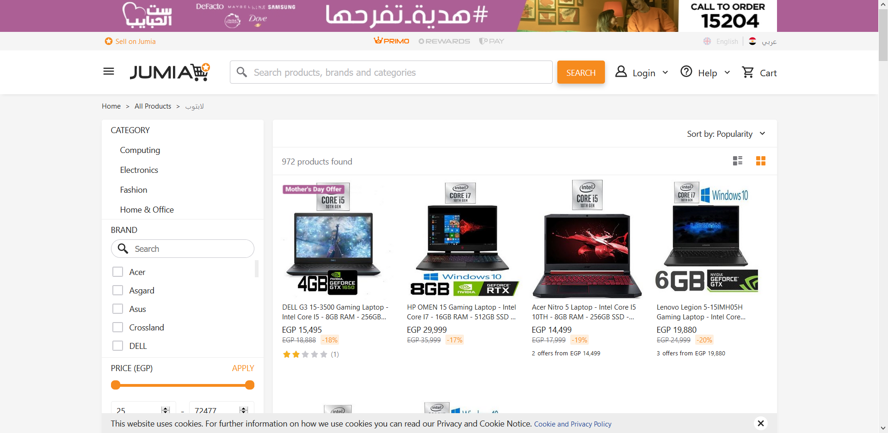
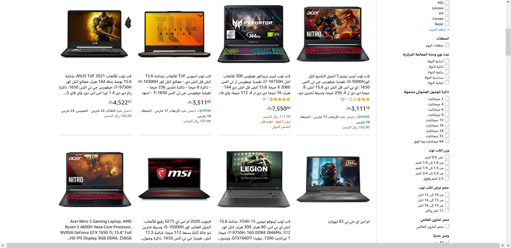
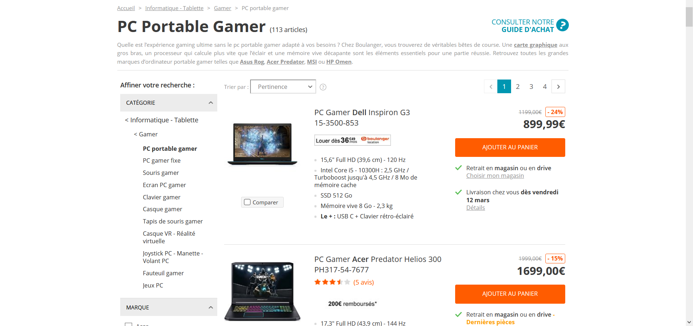
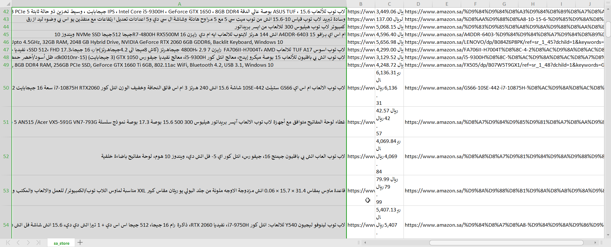
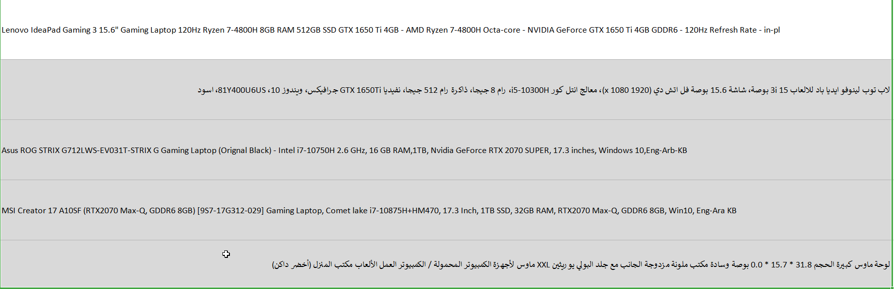
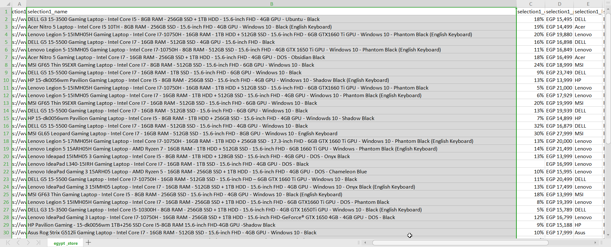
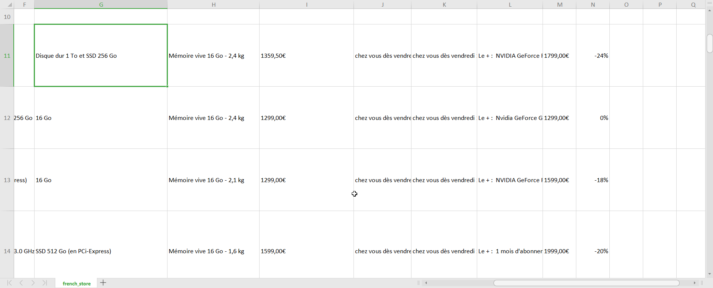

# Introduction
This project was created to analyse the Gaming Laptops market globaly. by comparing 3 diffrent E-commernce websites with diffrent laguages, currencies, populations, contenets. this project was composed of both gathering, cleaning, visualizing, Hypothesizing and concluding. 

# Index
- [Motive](#motive)
- [Dataset](#dataset)
  - [Dataset Source](#dataset-source-scrapped)
  - [Feature Description](#feature-description)
- [Summary of Findings](#summary-of-findings)
  - [Intel vs AMD CPU](#intel-vs-amd-cpu)
  - [Key Insights for Presentation](#key-insights-for-presentation)
  - [Intel vs AMD CPU](#intel-vs-amd-cpu-1)
  - [Resources](#resources)

# Motive  

**Gaming Laptops** are a very widespread product sold in all parts of the wrold with a huge price varaition and quality variation. we explore today the realtion between price, the reigion, discount, cpu, gpu, ram.

# Dataset 

## Dataset Source \(Scrapped\) 

the Dataset consists of 3 scrapped ecommerce websites that were all scraped on the same day 1/5/2020.

each of the websites is it's own format and structure.

1- website 1: [Jumia](https://www.jumia.com.eg/) which is an egyptian ecommerce site that sells all products but is known for its tech deals and high discounts.

2- [Amazon.sa](https://www.amazon.sa/) which is the subsidary of the famous company Amazon in Saudi Arabia \(KSA\).

## 

3- [Boulanger](https://www.boulanger.com/) a local french eccomerce site that is famous for cheap prices espacially in the salles.

## 

each of these site had a search term "Gaming Laptop" written in the search bar and then the result was scrapped for either 5 pages or till the end.

_NB:this data was scrapped programmatically from 3 diffrent sites in 3 diffrent contries with a vpn to assure local data is shown._

## Feature Description 

### Laptops.csv

* this is the aggregated dataset that was created during the cleaning phase from merging the scraped data from all 3 sites

1. **text:** scraped text from the site
2. **url:** the url of the link that was scrapped
3. **price:** price in dollars after cleaning and unifing the dataset
4. **cpu\_name:** the name of the cpu like i7, Ryzen 5
5. **cpu\_gen:** the generation of the cpu, ex: generation 7, 9, 5
6. **discount\_value:** the percentage of the discount
7. **store** the store from which this row was scrapped

### egypt\_store.csv

> Original dataset that was scraped from Jumia.eg further cleaning and feature extraction was done on this dataset during the cleaning phase 1. **selection1\_url:** url pointing to the link of the product

1. **selection1\_name:** name of the product as written on the site
2. **selection1\_discount:** discount value
3. **selection1\_price:** price of the product in EGP
4. **selection1\_brand:** Brand name \(ex: Lenovo, DELL\)
5. **selection1\_brand\_url:** link to the main site of the brand like Lenovo

### french store.csv

> Original dataset that was scraped from Jumia.eg further cleaning and feature extraction was done on this dataset during the cleaning phase

1. **Title:** name of the product on the site
2. **Title\_link:** link to product

3.**bestpoints:** dsplay info and other usefull info of the product **caracValue:** column with info about the specs of the laptop but it is not consistent so it has to be cleaned

1. **caracValue1:** refresh rate of dsiplay
2. **caracValue2:** cpu inforamtion
3. **caracValue3** storage info
4. **fix-price:** price in EUR
5. **stock:** stock infromation also info about delivery
6. **nb-opcom-1:** more specs like I/O ports and other modules
7. **Le+:** more specs
8. **priceBarre:** price before discount in EUR
9. **priceDiscount:** discount

### sa\_store.csv

> data scrapped from amazon KSA all the laptop specs were cramped in the name of the product so a lot of cleaning had to be done to extract these features

1. **selection1\_name:** name of the product which has all the specs in it
2. **selection1\_url:** link to product
3. **selection1\_selection2:** price in SAR
4. **selection1\_selection2\_url:** link to product

# Cleaning

> Three sites with 3 diffrent Languages won't be easy 👀

Because every Dataset was scrapped from a diffrent site using a diffrent script and beacuse each site has a diffrent layout. the data is naturally messy.

Here you can find my thoughts process with some examples for each dataset.

### These are the main problem I had to fix. details on how I did that are in the [Cleaning notebook](/clean.ipynb)

## sa_store.csv (Amazon.sa)
> This Dataset was terrible as Amazon put all the features into 1 column which is the name of the product

---
> Even more the Sellers did not even have to write in english so some of the words were in english, some arabic and some Franco (Arabic letters with Enlish pronouciation). also some entries had both english and arabic letters in the same column

---

> Not all the results were even laptops some of them were simply Laptop accessories

*Ex: in the above picture the last row is actually a mouse pad*

---
### Tasks
1. extract GPU info including GPU model number and generation
2. extract CPU 
3. exrtact Ram info
4. extract Storage info including Storage type and capacity 
5. dont forget there could also be a 2nd storage we need to account for
6. remove Nan values
7. Remove non Laptop Entries

## egypt_store.csv (Jumia)
> this Dataset had a lot of bad columns with many of the features in the name like the CPU type, Ram, Storage so they had to be extracted. luckly there was a pattern in how the site wrote it's info which I was sometimes able to exploit

---
### Tasks
1. extract GPU info including GPU model number and generation
2. extract CPU 
3. exrtact Ram info
4. extract Storage info including Storage type and capacity 
5. dont forget there could also be a 2nd storage we need to account for
6. remove Nan values
7. make sure everything is consistent

## french.csv (Boulangaire)
> this was the most consistent and cleaned data as almost every feature was extracted in it;s own column
---
> A bit tricky as it was written in French so the extraction of the columns had to be done in french too.

---
### Tasks
1. extract GPU info including GPU model number and generation
2. extract CPU 
3. extract Weight
4. extract Storage info including Storage type and capacity 
5. dont forget there could also be a 2nd storage we need to account for
6. remove Nan values
7. exrtact Ram info

# Summary of Findings 

1. **Slide show** Demonsrating the key insights in a presentation, suitable for meetings. [Slide show](./explanatory.slides.html) 
<a href='./explanatory.slides.html' target="_blank">link</a>

2. Analysis Notebook showing the code, thought proceess, Visualizations, Feature extractions and background of the entire project. [Analysis Notebook]('./explanatory.ipynb)

3. Exploratory Notebook showing the exploration steps taken and tought process when I was exploring the dataset for the first time. [Exploration Notebook]('./Explonatory.ipynb)

4. essay summerizing the key inisghts in case a written formal report is needed for archiving. [Exploration Notebook]('./Summary.ipynb)
